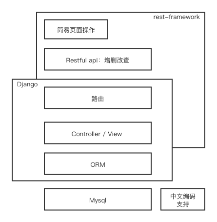
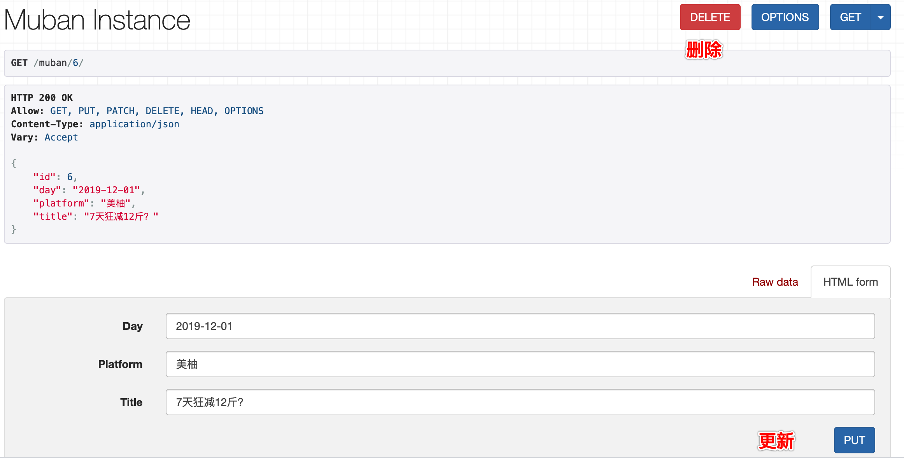

---
<br/>


<br/>**记录**
1. 环境的安装（centos7.4&64）：mysql/django/python3/pip3...
2. Django的使用&基本配置
3. 增删改查简易服务（Restful API & DB持久化）
4. 效果 & 页面操作

<br/>

> ### 环境安装

- 安装 python36/pip3
```shell
yum install python36
yum install python3-pip
```

- 安装DB
```
yum install mariadb mariadb-server
yum install MySQL-python
systemctl start mariadb
mysql_secure_installation
mysql -uroot -p123
sql > create database helloworld
```

- 安转Django/pymysqldb/rest-framework等
```
#版本 pip3 list
asgiref (3.2.3)
certifi (2019.11.28)
chardet (3.0.4)
coreapi (2.3.3)
coreschema (0.0.4)
Django (3.0.1)
django-filter (2.2.0)
django-rest-swagger (2.2.0)
djangorestframework (3.11.0)
idna (2.8)
itypes (1.1.0)
Jinja2 (2.10.3)
MarkupSafe (1.1.1)
openapi-codec (1.3.2)
pip (9.0.3)
PyMySQL (0.9.3)
pytz (2019.3)
requests (2.22.0)
setuptools (39.2.0)
simplejson (3.17.0)
six (1.13.0)
sqlparse (0.3.0)
uritemplate (3.0.1)
urllib3 (1.25.7)
```
```
更换国内源速度快：-i https://pypi.tuna.tsinghua.edu.cn/simple/
pip3 install Django  
pip3 install PyMySQL
pip3 install djangorestframework
pip3 install django-filter
```

> ### 2. Django使用&配置

- 创建项目&APP 
```
django-admin startproject helloworld
python3 manage.py startapp muban
```

- model同步DB(每次model更新同步DB)
```
python3 manage.py makemigrations [appname]
python3 manage.py migrate [appname]
```

- 启动服务
```
[nohup] python3 manage.py runserver 0.0.0.0:8080 [&] 
```

- 配置setting.py

```python
# host通行，IP/域名
ALLOWED_HOSTS = ['106.12.160.72']

INSTALLED_APPS = [
    ...
    'muban', # 创建的app
    'rest_framework',
    'django_filters',
]

# rest-framework配置
REST_FRAMEWORK = {
    'DEFAULT_PERMISSION_CLASSES': [
    'rest_framework.permissions.AllowAny',
    ],
    'PAGE_SIZE': 10,
    # 配置过滤
    'DEFAULT_FILTER_BACKENDS': ('django_filters.rest_framework.DjangoFilterBackend',)
}

# db-mysql
DATABASES = {
    'default': {
        'ENGINE': 'django.db.backends.mysql',
        'NAME': 'helloworld',
        'USER': 'root',
        'PASSWORD': '123',
        'HOST': '127.0.0.1',
        'PORT': '3306',
        'OPTIONS': {
            'sql_mode': 'TRADITIONAL',
            'charset': 'utf8',
            'init_command': 'SET '
            'storage_engine=INNODB,'
            'character_set_connection=utf8,'
            'collation_connection=utf8_bin'
        }
    }
}

# 编码支持中文
from django.utils.translation import gettext_lazy as _
LANGUAGES = [
    ('zh-Hans', _('Chinese')),
]

TIME_ZONE = 'Asia/Shanghai'
LANGUAGE_CODE = 'zh-Hans'
DEFAULT_CHARSET = 'UTF-8'

```

- PyMySQL 额外配置

```python
# vim helloworld/__init__.py
import pymysql
pymysql.install_as_MySQLdb()
```

> ### 3. 增删改查简易服务

* 模型

```python
# vim muban/model.py
class Muban(models.Model):
    day = models.CharField(max_length=20)
    platform = models.CharField(max_length=100)
    title = models.CharField(max_length=256, null=True)

# 执行如上model同步DB操作
```

* Restful API -  视图 ModelViewSet增删改查聚合

*<u>Django Rest-Framework官方介绍:<https://www.django-rest-framework.org/></u>*

```python
# vim muban/view.py 
from rest_framework import viewsets
from .serializers import MubanSerializer
from .models import Muban
from django_filters import rest_framework as filters

## 支持listapi 中platform/day字段过滤
class MubanFilter(filters.FilterSet):
    class Meta:
        model = Muban
        fields = ['platform', 'day', ]

class MubanViewSet(viewsets.ModelViewSet):
    queryset = Muban.objects.all()
    serializer_class = MubanSerializer
    #filter_backends = (filters.DjangoFilterBackend,)
    filter_class = MubanFilter
```

- Restful API -  序列化

```python
# vim muban/serializers.py  
from rest_framework.serializers import ModelSerializer
from .models import *

class MubanSerializer(ModelSerializer):
    class Meta:
        model = Muban
        fields = "__all__" # ('day', 'platform', 'title')
```

- Restful API - 路由

```python
# vim helloworld/urls.py
from django.contrib import admin
from django.urls import include, path
from rest_framework import routers

from muban import views

router = routers.DefaultRouter()
router.register(r'muban', views.MubanViewSet)

urlpatterns = [
    path('admin/', admin.site.urls),
    path('', include(router.urls)),
]
```

> ### 4. 效果 & 页面操作

- 列表/查 
	- go=> <http://IP:8034/muban/>
	- filter: <http://IP:8034/muban/?platform=xx&day=xx>
- 新增
	- go=> <http://IP:8034/muban/>
	- 填写字段 => POST
- 更新删除
	- go=> <http://IP:8034/muban/{ID}> 
	- DELETE & PUT
	- 

